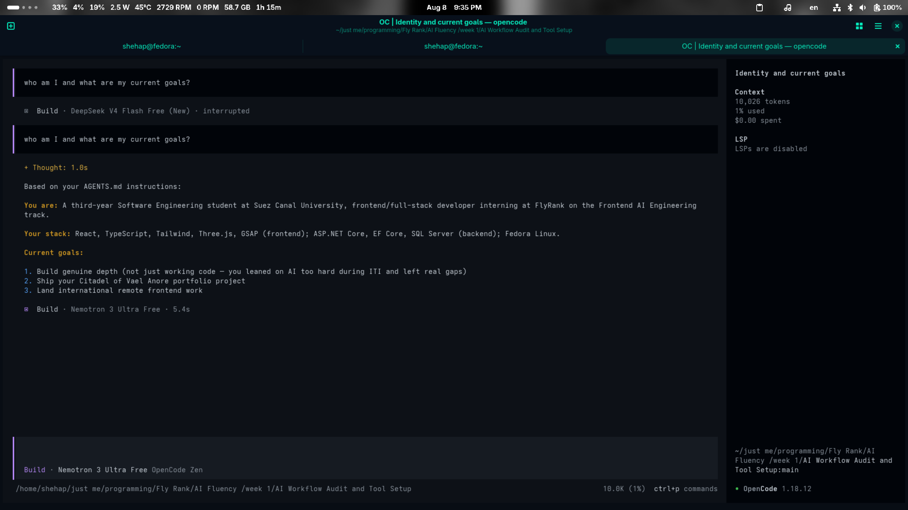

# AI Workflow Audit and Tool Setup

## 1. Task Classification

| # | Task | Classification | Rationale |
|---|------|----------------|-----------|
| 1 | FlyRank weekly frontend assignments (React/Three.js/GSAP features) | Collaborate with AI | Real-time pairing on animation logic and component structure — this is the actual skill the internship is testing |
| 2 | EF Core scaffolding, migrations, seeding | Delegate to AI with review | Boilerplate-heavy and error-prone; I check FK relationships and schema against the ER diagram before merging |
| 3 | Citadel of Vael Anore — hand-illustrated Krita assets (pixel art, wizard cat) | Just me | The entire value of the project is that it's hand-illustrated; AI art would kill the thing that makes it mine |
| 4 | University problem sets (OOP/C#, algorithms, DB design) | Just me | Got burned doing ITI assignments through AI — left real gaps in my .NET knowledge. Not repeating that |
| 5 | Codeforces practice | Just me | The point is building my own problem-solving reflexes; having AI solve it defeats the exercise entirely |
| 6 | Linux/.NET environment debugging (namespace errors, Docker, port conflicts) | Collaborate with AI | Diagnostic back-and-forth is faster with AI, but I verify every fix actually works in my Fedora setup |
| 7 | Repo structure / monorepo setup / CLAUDE.md conventions | Collaborate with AI | AI drafts conventions fast, but the architecture decisions and what to enforce are mine |
| 8 | CV and LinkedIn copy | Delegate to AI with review | AI drafts, but I rewrite anything that doesn't sound like my actual voice before publishing |
| 9 | Reddit posts (e.g. The Finals dash-cooldown balance idea) | Delegate to AI with review | AI tightens the writing; the mechanic and the reasoning behind it are mine |
| 10 | DaVinci Resolve video editing (hobby) | Collaborate with AI | Still learning the tool — AI explains features, but the actual cuts and creative choices are mine |
| 11 | Deadline/reminder tracking (uni + internship submissions) | Fully automate | No judgment needed — a calendar app doing its job reliably beats me remembering |
| 12 | Long lecture notes → summary for exam review | Delegate to AI with review | AI compresses volume fast; I check it didn't drop or misstate anything before I study from it |
| 13 | System admin on Fedora (drivers, dual-boot, Samba transfers) | Collaborate with AI | AI speeds up diagnosis of obscure errors, but I run and verify every command myself |

## 2. Toolkit Setup

- [Done] OpenCode setup
- [Done] Claude account created
- [Done] ChatGPT account created
- [x] Anthropic Academy account created — enrolled in *AI Fluency: Framework & Foundations*, Module 1 complete

## 3. Custom Instructions Setup

> Using OpenCode instead of the Claude.ai web app (approved) — equivalent
> custom instructions configured via global `AGENTS.md`.

## 4. Target Tasks for Week 2 Onward

| Target task | "Done well" means |
|---|---|
| Frontend feature builds with AI (Three.js/GSAP) | Feature ships meeting performance targets (no visible frame drops), and I can explain every animation technique used without re-reading the AI's explanation first |
| Backend scaffolding with AI (EF Core/SQL Server) | Zero AI-generated migration or seed code merges without my manual check against the ER diagram; no orphaned FK bugs reach a PR |
| Repo/documentation conventions (CLAUDE.md, monorepo structure) | A future contributor — or future me — can onboard and build the project using only the written docs, with zero clarifying questions needed |